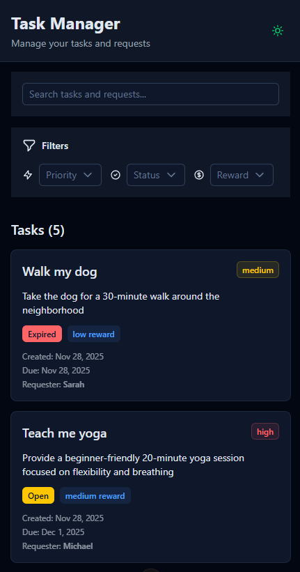
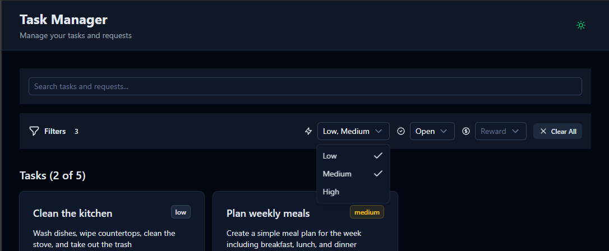
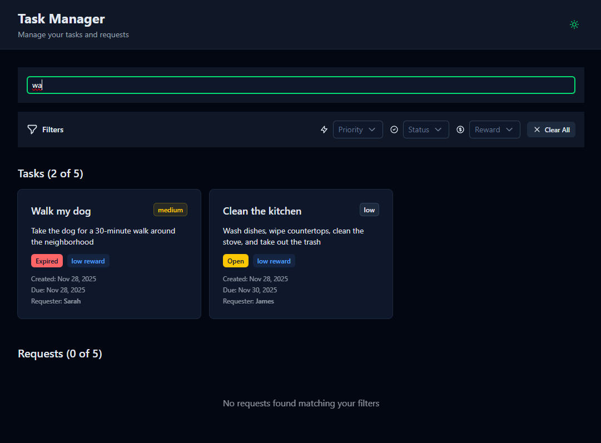

# Task Management Application

A Vue.js task management app built with Nuxt 4, Nuxt UI v4, and TypeScript.

## Screenshots

### Desktop


### Mobile


### Filters


### Search



## Tech Stack

- Vue
- Nuxt 4
- Nuxt UI v4
- TypeScript
- Tailwind CSS

## Features

**Implemented:**
- Task display with dummy data
- Search by title/description
- Filter by status, priority, and type
- Responsive design (desktop and mobile)

**Not Implemented due to time constraints:**
- Task detail modals
- Backend/API
- Offline mode

## Setup

```bash
npm i
npm run dev
```

## Project Structure

```
app/
├── app.vue              # Root component
├── layouts/default.vue  # Layout
└── pages/index.vue      # Main page

components/
├── SearchFilter.vue     # Search and filters
└── TaskCard.vue         # Task card

composables/
└── useTasks.ts          # Task data and logic

types/
└── task.ts              # TypeScript types
```

### Notes

- Started by creating a mental checklist of the implementation order:

1. Initial setup
2. Frontend with dummy data
3. Restructured /app/ directory
4. Added search and filters

- Initially omitted `@nuxt/icons` thinking I'd import SVGs manually (mistake, but too late after first commit)
- I thought I would have time to implement images in posts, hereby why I installed `@nuxt/images`
- Avoided `vite-pwa/nuxt`, as far as I understood it's mainly for Nuxt 3
- This is my second Vue project. I should have spent more time learning Vue/Nuxt fundamentals before jumping into implementation.
- After watching a few tutorials after starting the initial day 1 prototype I scrapped it all and started fresh on day 2.
- Given the time constraints, I focused on core functionality and responsive design rather than complete feature implementation.